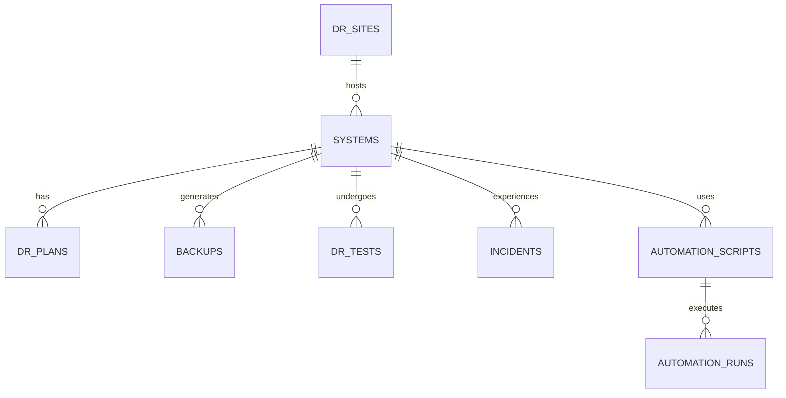

# Disaster-Recovery-Backup-Automation

## 1. Objectives

| Metric | Target | Definition |
|---|---|---|
| **RPO** (Recovery Point Objective) | 15 minutes | Max acceptable data loss |
| **RTO** (Recovery Time Objective) | 1 hour | Max acceptable downtime |
| **RTO — full region loss** | 4 hours | Cross-region failover, worst case |

If actual recovery time during a drill or incident exceeds these targets, that's the signal to invest further in automation, not to move the goalposts.

---

## 2. Backup Inventory

| Asset | Backup method | Frequency | Location | Retention |
|---|---|---|---|---|
| RDS / primary DB | AWS Backup snapshot (PITR-capable) | Continuous + daily snapshot | Primary + DR region vault | 35d daily / 180d weekly / 7yr monthly |
| DB logical dump | `scripts/db_backup.sh` (pg_dump/mysqldump) | Daily, 03:00 UTC | S3 (`my-org-db-backups`), replicated to DR region | 35d → Glacier at 90d → expire 365d |
| EBS volumes | AWS Backup | Daily | Primary + DR vault | 35d |
| Application config / secrets | Git + secrets manager versioning | On every change | GitHub + AWS Secrets Manager | Indefinite (git history) |
| Terraform state | S3 backend with versioning | On every apply | S3 (separate state bucket) | Indefinite |
| Container images | Registry with immutable tags | On every build | ECR, replicated cross-region | 90d for untagged, indefinite for release tags |

**S3 Object Lock** and **AWS Backup Vault Lock** are enabled on primary backup stores — this means backups can't be deleted even by a compromised admin account during the lock window. This is the specific defense against ransomware that also targets your backups.


A REST API for the disaster recovery dashboard. In-memory data store —
everything resets on restart. Swap the `db` object in `server.js` for a real
database when you're ready to persist data.

## Run it

```
npm install
npm start
```

Server starts on `http://localhost:4000` (set `PORT` to change it).

## Endpoints

| Method | Path | Description |
|---|---|---|
| GET | `/api/health` | Health check |
| GET | `/api/summary` | Dashboard hero metrics (critical/high counts, active teams, recovery %) |
| GET | `/api/incidents` | List incidents. Filter with `?severity=` or `?status=` |
| GET | `/api/incidents/:id` | Get one incident |
| POST | `/api/incidents` | Report a new incident (`title`, `severity` required) |
| PATCH | `/api/incidents/:id/status` | Update incident status |
| DELETE | `/api/incidents/:id` | Remove an incident record |
| GET | `/api/resources` | List resource capacity (compute, bandwidth, backup, on-call) |
| PATCH | `/api/resources/:id` | Update a resource's `used`/`total` |
| GET | `/api/teams` | List response team members and status |
| PATCH | `/api/teams/:id/status` | Update a responder's status |

## Wiring up the frontend

The `index.html` dashboard currently uses hardcoded sample data. To connect it
to this API, fetch from these endpoints and replace the static markup, e.g.:

```js
fetch('http://localhost:4000/api/incidents')
  .then(res => res.json())
  .then(data => renderIncidents(data.incidents));
```

Remember to update the frontend's fetch URLs if you deploy this API somewhere
other than `localhost:4000`.
# DR & Automation Tracker — MySQL Database

A MySQL database that models a **Disaster Recovery + Automation tracking system** — useful as a portfolio project to demonstrate DR concepts (RTO/RPO, DR sites, backups, failover tests, incidents) alongside automation script/run tracking.

## Schema Overview



| Table | Purpose |
|---|---|
| `dr_sites` | DR site inventory (hot/warm/cold, provider, region) |
| `systems` | Business systems/apps with RTO/RPO targets and criticality tier |
| `dr_plans` | Documented DR strategy per system (Pilot-Light, Warm-Standby, etc.) |
| `backups` | Backup job history (type, status, size, verification status) |
| `dr_tests` | DR drill/test results (tabletop → full-interruption) |
| `incidents` | Real outages, whether DR was invoked, downtime (auto-calculated) |
| `automation_scripts` | Registry of failover/backup/provisioning scripts |
| `automation_runs` | Execution history/logs of automation scripts |
| `v_system_dr_posture` | View: current DR readiness snapshot per system |

## Setup

```bash
mysql -u root -p < schema.sql
mysql -u root -p < seed_data.sql
```

## Example Queries

```sql
-- DR readiness snapshot
SELECT * FROM v_system_dr_posture;

-- Systems whose last DR test failed or was partial
SELECT s.system_name, t.test_date, t.result, t.notes
FROM dr_tests t
JOIN systems s ON s.system_id = t.system_id
WHERE t.result IN ('Fail','Partial')
ORDER BY t.test_date DESC;

-- Backups that have never been restore-verified
SELECT s.system_name, b.backup_id, b.start_time
FROM backups b
JOIN systems s ON s.system_id = b.system_id
WHERE b.verified = FALSE AND b.status = 'Success';

-- Total downtime per system (from real incidents)
SELECT s.system_name, SUM(i.downtime_minutes) AS total_downtime_minutes
FROM incidents i
JOIN systems s ON s.system_id = i.system_id
GROUP BY s.system_name
ORDER BY total_downtime_minutes DESC;

-- Automation script reliability
SELECT a.script_name,
       COUNT(*) AS total_runs,
       SUM(r.status = 'Success') AS successful_runs,
       ROUND(SUM(r.status = 'Success') / COUNT(*) * 100, 1) AS success_rate_pct
FROM automation_runs r
JOIN automation_scripts a ON a.script_id = r.script_id
GROUP BY a.script_name;
```

## Files

- `schema.sql` — table definitions, foreign keys, indexes, and a summary view
- `seed_data.sql` — realistic sample data (5 systems, 4 DR sites, backups, tests, incidents, automation runs)

## Notes

- Requires MySQL 8.0+ (uses generated columns, CTE-friendly syntax).
- `downtime_minutes` in `incidents` is a **generated column** — computed automatically from `start_time`/`resolved_time`, no manual calculation needed.
- Extend this further with tables for `notification_contacts`, `sla_agreements`, or `compliance_audits` if your project needs it.
